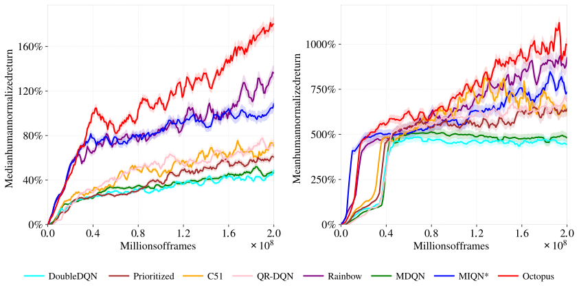
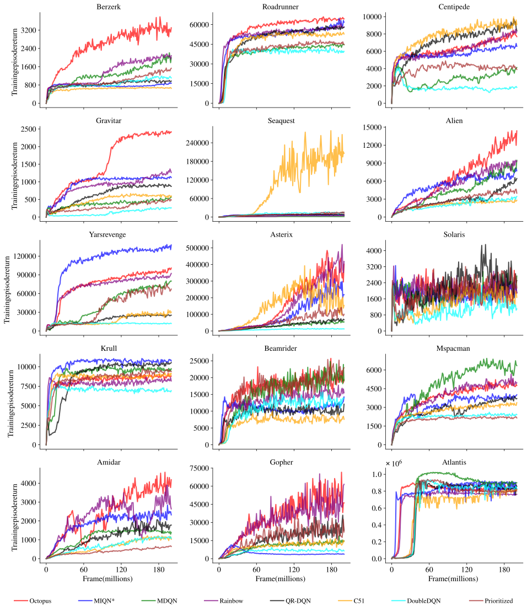
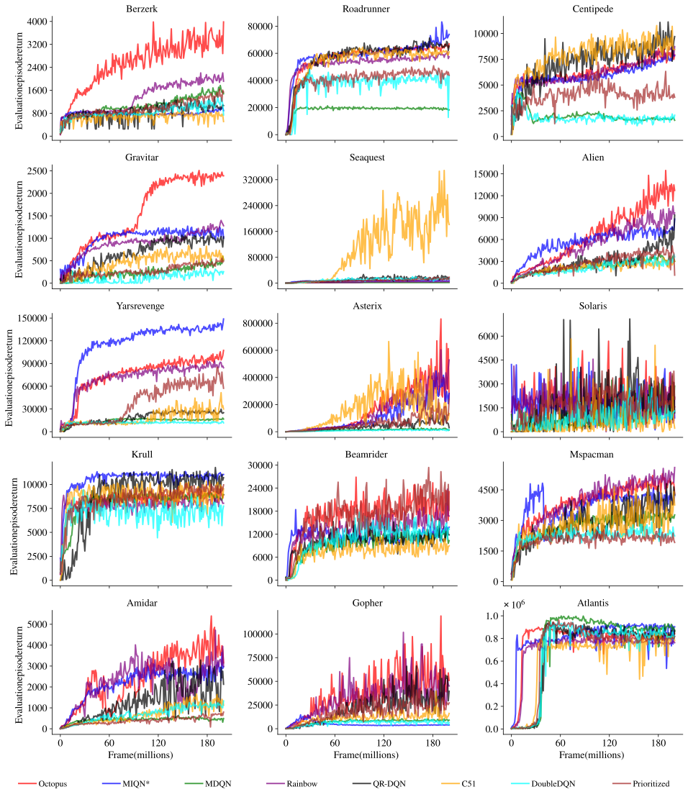
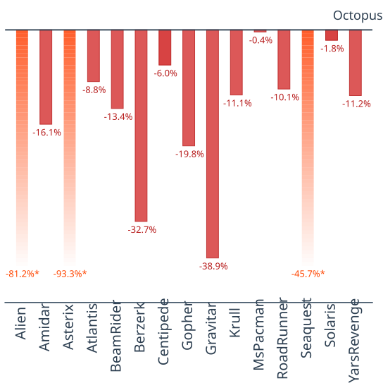

# Octopus
Octopus is a reinforcement learning repository built around the proposed Octopus agent, a regularized distributional DQN method for improved stability and performance.

It is designed to be self-contained and extensible. The repository includes Octopus together with standard baseline agents, implemented in JAX, Haiku, and RLax, and provides a unified framework for training and evaluation on the Atari 2600 benchmark.

Beyond Atari benchmarks, the Octopus framework is intended to be applicable to real-world sequential decision-making problems, including electricity network optimization. This application is part of ongoing work and is not included in the current repository.

---

## Agents Implemented

| Agent      | Method Summary                                                                 | Reference |
|------------|--------------------------------------------------------------------------------|-----------|
| Double DQN | Reduces overestimation via decoupled action selection and evaluation          | [Deep Reinforcement Learning with Double Q-learning](https://arxiv.org/abs/1509.06461) |
| Prioritized DQN | Improves sample efficiency through prioritized experience replay        | [Prioritized Experience Replay](https://arxiv.org/abs/1511.05952) |
| C51        | Learns a categorical approximation of the return distribution                 | [A Distributional Perspective on Reinforcement Learning](https://arxiv.org/abs/1707.06887) |
| QR-DQN     | Models return distribution via quantile regression                            | [Distributional Reinforcement Learning with Quantile Regression](https://arxiv.org/abs/1710.10044) |
| Rainbow    | Combines multiple DQN improvements into a unified framework                   | [Rainbow: Combining Improvements in Deep Reinforcement Learning](https://arxiv.org/abs/1710.02298) |
| MDQN       | Incorporates Munchausen reward shaping for improved exploration and stability | [Munchausen Reinforcement Learning](https://arxiv.org/abs/2007.14430) |
| MIQN*      | Munchausen-based distributional variant with enhancements aligned to Octopus  | [Munchausen Reinforcement Learning](https://arxiv.org/abs/2007.14430) |
| Octopus    | Regularized distributional RL framework with dynamic scaling                  | — |


Median human-normalized return across 15 Atari games for all agents:
<p align="center">
  
</p>


---

## Learning Curves

### Training Performance

Training learning curves across 15 Atari games, showing episode return as a function of environment frames.

<p align="center">
  
</p>

### Evaluation Performance

Evaluation learning curves across 15 Atari games, measuring policy performance without exploration noise.

<p align="center">
  
</p>

---

## Octopus Agent

Octopus extends distributional reinforcement learning by incorporating KL-based regularization into the value distribution update:

$$
Z(s, a) \stackrel{D}{=} R(s, a) + \alpha \tau \log \pi(a | s)
+ \gamma \left(Z(S', A') - \tau \log \pi(A' | S')\right)
$$

where:
- $Z(s,a)$: return distribution  
- $\pi(a|s)$: policy  
- $\gamma$: discount factor  
- $\alpha, \tau$: regularization coefficients  

This formulation introduces entropy-based regularization into both immediate rewards and future returns, improving stability during training.

---

### Dynamic Regularization Scaling (DRS)

To mitigate overly conservative updates, we introduce a **Dynamic Regularization Scaling (DRS)** mechanism.

The scaling factor $\psi(k)$ evolves over training iterations:

$$
\psi(k) =
\begin{cases}
0 & k < K_{\min} \\
\frac{k - K_{\min}}{K_{\max} - K_{\min}} \psi_{\max} & K_{\min} \le k \le K_{\max}
\end{cases}
$$

where:
- $k$: training iteration  
- $K_{\min}, K_{\max}$: start and end of scaling  
- $\psi_{\max}$: maximum regularization strength  

This schedule gradually increases the strength of regularization during training:

- **Early stage**: weak regularization → encourages exploration  
- **Mid stage**: moderate regularization → stabilizes learning  
- **Late stage**: strong regularization → improves convergence stability  

Ablation study evaluating the impact of Dynamic Regularization Scaling (DRS) across 15 Atari games:
<p align="center">
  
</p>

---

### Key Idea

Octopus combines distributional reinforcement learning with adaptive regularization to improve both stability and performance.

- KL-based regularization stabilizes policy updates  
- Distributional learning captures return uncertainty  
- Dynamic Regularization Scaling (DRS) balances exploration and convergence  

In addition, Octopus integrates several established RL components, including dueling networks, double Q-learning, prioritized replay, noisy networks, and multi-step learning within a unified framework.

---

## Getting Started

### Requirements

This repository is tested with Python 3.9 and the following key dependencies:

- JAX / Haiku / RLax (core reinforcement learning framework)
- Gym + Atari-Py (environment interface)
- Optax / TensorFlow Probability (optimization and distributions)
- NumPy / SciPy / Pandas (numerical computation)
- Matplotlib (visualization)

#### Notes

- The implementation is based on the JAX ecosystem (JAX, Haiku, RLax).
- Atari environments require ROM installation via `atari-py`.
- Exact versions are fixed in `requirements.txt` for reproducibility.

### Environment Setup

Create a Python (≥3.9) virtual environment and install dependencies:

```bash
python -m venv .venv
source .venv/bin/activate

pip install -r requirements.txt
```

Import Atari ROMs (required for training):

```bash
python -m atari_py.import_roms /path/to/roms
```

---

### Training

Each agent is implemented in its own directory. To train an agent on an Atari game:

```bash
cd <agent_name>
python run_atari.py \
  --environment_name amidar \
  --seed 1 \
  --results_csv_path ../results/<agent_name>_amidar_seed1.csv
```

**Key arguments:**

- `--environment_name`: Atari game (e.g., `amidar`, `pong`, `breakout`)
- `--seed`: random seed for reproducibility
- `--results_csv_path`: path to save training metrics

All agents share the same training interface for consistent benchmarking.

---

## Code Structure

Each agent directory contains an implementation of a DQN-based variant configured for Atari experiments.  
Within each agent folder:

- `agent.py` defines the agent logic, including action selection, learning updates, and agent state management.
- `run_atari.py` provides the training entry point for running the agent on Atari environments.

Shared modules at the repository root provide common infrastructure used across agents:

- `networks.py` defines the Haiku neural network architectures used by the agents.
- `replay.py` implements experience replay components.
- `processors.py` contains standard Atari preprocessing utilities.
- `parts.py` provides shared training and evaluation utilities, including logging, statistics accumulation, and the main run loop.
- `atari_data.py` contains utilities related to Atari benchmark data handling.
- `gym_atari.py` provides Atari environment setup and wrappers.
- `plot.py` generates performance plots from saved training results.
- `assets/` stores figures of experiment results used in the README.

---

### Evaluation and Plotting

To generate human-normalized performance plots:

```bash
python plot.py
```

This produces `normalized_score.pdf` in the working directory.

**Expected results structure:**

```text
results/
  ├── Octopus/
  ├── Rainbow/
  ├── C51/
  ├── Double_Q/
  ├── Prioritized/
  ├── MDQN/
  ├── MIQN_star/
  └── QR-DQN/
```

Each directory should contain CSV files named as:

```text
results_<agent>_<game>_seed<seed>.csv
```

For example:

```text
results_octopus_amidar_seed1.csv
```

---

### Reproducibility

- All experiments are controlled via explicit random seeds.
- A unified training interface ensures consistent evaluation across agents.
- Results can be directly aggregated and visualized using the provided plotting utilities.

---


## Acknowledgements

This repository is adapted and extended from the original implementation:

* DeepMind DQN Zoo: https://github.com/google-deepmind/dqn_zoo

We build upon the original codebase and extend it with additional algorithms, including the proposed **Octopus** framework and related variants.
